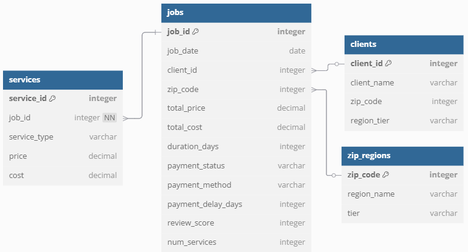
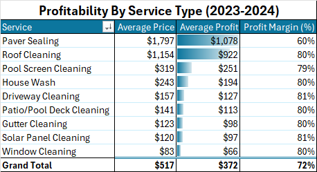
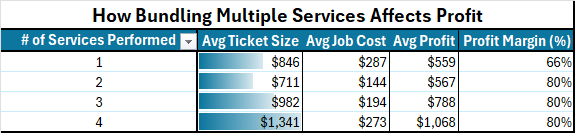

# Home Services Operational Dashboard

I ran an exterior cleaning business in Orlando, FL before transitioning into data analytics. This dashboard uses synthetic data modeled on that experience, scaled up in volume to uncover trends I always wanted better visibility on as an owner.

📊 [Excel Dashboard](./home_services_project.xlsx)

## 🧠 Executive Summary

This project uncovers key insights into how a small home services company operates in real life, in terms of volume, profitability, and customer behavior:

- **Consistent Volume:** ~90 jobs/month across two years, reflecting sustainable operations.
- **Bundling Wins:** Jobs with 3-4 services delivered 40-90% more profit per job.
- **Top Services:** Roof Cleaning and Paver Sealing dominate profit and revenue.
- **Healthy Margins:** Most services yield 80%+ profit margins, even when bundled.
- **Customer Trends:** 30% repeat client rate and 41% multi-service booking rate.

## 🔧 Dataset Creation

Using Python (in VS Code), with help from ChatGPT, I built a data generator powered by `Faker` and `NumPy` that mirrors real operational patterns: seasonal demand, ZIP-based pricing, bundling, and repeat clients.

🛠️ [Data Generation Script](./data_generation/generate_dataset.py)  
📂 [Data Folder](./data/)  

## 💡 Key Business Questions Answered

- **Which services drive the most profit and why?**
- **How do bundled jobs compare to single-service bookings?**
- **Are we operating near job capacity across months?**
- **What’s the ratio of repeat clients and multi-service customers?**
- **How do profit margins shift with seasonal demand?**

## 📊 Analysis Summary

### 1. **Operational Efficiency and Growth Over Time**

- Job volume remained steady between the two years, with 531 jobs completed in 2023 and 551 in 2024. This reflects strong operational consistency in a seasonal and demand-driven industry. Monthly job completion averaged around 90, suggesting the business operated near capacity without frequent overloading.

- The rolling 7‑day average, plotted alongside a 3-jobs-per-day ceiling, confirmed that even during busier months, job load stayed within manageable limits. This supports a realistic model for small teams and lean operations.

### 2. **Revenue and Profit by Service Type**

- Paver Sealing brought in the highest average ticket at around $1,800 per job, though it maintained slimmer profit margins at roughly 60%. Roof Cleaning, by comparison, averaged $1,150 per job but held a strong 81% profit margin, making it the most valuable blend of volume and profitability.

- Other services like window and driveway cleaning stayed in the $80-$320 range with strong margins, showing solid cost control across the board.

    

### 3. **Bundling Strategy Impact**

- Jobs with multiple services consistently produced higher total profit. Single-service jobs averaged $559 in profit, while bundling four services pushed the average to $1,068.

- Although total job cost rose slightly with more services, profit margins remained stable around 80%, suggesting bundling boosts efficiency without hurting profitability.

- Interestingly, average job cost was actually higher for single-service jobs. This is due to high-ticket services like paver sealing and roof cleaning often being booked alone. These services carry higher costs, but their strong margins keep them highly profitable. When smaller, lower-cost services are bundled, margins improve and total profits climb, highlighting the value of cross-service packaging.

    

### 4. **Seasonality and Scheduling Patterns**

- Spring months like April and May showed the highest job volume, with a summer taper and a secondary spike around the holiday season. This pattern aligns with observed demand trends in Florida-based operations, where winter weather doesn’t constrain year-end service work.

- Despite the seasonal demand, job load never breached the daily capacity threshold, showing that scheduling remained controlled and sustainable across the year.

### 5. **Customer Behavior and Retention**

- Roughly 30% of bookings came from repeat clients, a healthy figure with potential for improvement through retention efforts and loyalty campaigns.

- About 41% of all jobs involved multiple services. Although discounted when bundled, these upsells still boosted total profitability. With healthy margins holding steady, bundling proved to be a strategic advantage, especially when promoted during high-demand months.

## 🎯 Conclusion & Key Takeaways

Building this dashboard helped confirm a few things that align with what I saw in the field:

- **Steady schedule, profitable bundles.** Reliable volume and strategic service combinations helped maintain margins year-round.
- **Profit comes from focus.** Roof cleaning and paver sealing drove the most revenue and should stay at the center of strategy.
- **Customer behavior tells a story.** With 30% of clients returning and 41% choosing bundled services, there's clear room to grow through retention and loyalty.
- **Synthetic doesn't mean random.** Modeling based on personal experience led to insights that feel grounded and usable, not generic.

This analysis builds on what I was already doing, tracking performance, testing ideas, and making data-informed decisions. Now I can uncover those insights faster and with more precision.

## 📌 Real Business Decisions That Informed This Dashboard

This dataset reflects patterns I observed running my exterior cleaning business in Orlando, FL. The decisions below were based on real metrics and field experience, before I had the tools to visualize them like this.

### 🏠 Residential Strategy and Service Patterns

| Metric Tracked                        | Decision Made                                                      | Outcome                                                  |
|--------------------------------------|---------------------------------------------------------------------|----------------------------------------------------------|
| Low winter revenue                   | Focused on promoting paver sealing instead of washing services in Nov/Dec | Created a second seasonal spike, boosting Q4             |
| Low job volume in early months       | Began pre-spring campaigns in Feb to fill March/April              | Filled schedule ahead of time                            |
| One-off jobs not converting well     | Pushed bundling with slight discounts                              | Higher avg. ticket size and profitability                |
| LSA lead performance       | Prioritized Local Service Ads after getting key commercial client  | This single lead source drove 60%+ of total 2025 revenue |
| Facebook ads underperforming         | Paused unprofitable campaigns, tested seasonal offers instead       | Lower spend, better ROI from word-of-mouth/EDDM          |
| Targeted EDDM campaign               | Sent postcards to high-income ZIP where we’d done past work         | Brought in many new residential jobs in that area     |

These decisions directly shaped how I structured the dataset. Bundling logic came from tracking which services customers paired most. ZIP-based pricing reflected quoting patterns since larger, more complex homes required more time and care. Seasonality mirrored actual demand trends, with spring bringing the biggest surge and winter requiring more strategic offers like paver sealing to stay busy.

To keep the assumptions realistic, I pulled from past invoices, estimates, and customer habits. Metrics like repeat rate, ticket size, and margin ranges weren’t invented. They came from actual business activity.
### 🧾 Commercial Project Snapshot

While not reflected in the dataset, commercial work was a major revenue driver and required more complex planning.

| Job Description                  | Scope                                | Revenue  | Duration | Key Challenge                                             |
|----------------------------------|--------------------------------------|----------|----------|-----------------------------------------------------------|
| Breezeway Cleaning (2024)        | 30 buildings                         | $10,000  | 6 days   | Manage water intrusion into units with poor weather seals |
| Building + Breezeway Wash        | 11 buildings, 3 stories              | $20,000  | 6 days   | Prevent chemical overspray onto cars                     |
| Breezeway Cleaning               | 12 buildings, 3 stories              | $7,200   | 3 days   | Clean grime without damaging painted breezeway floors     |
| Parking Garage Cleaning          | 5 floors                             | $11,000  | 5 days   | Extremely limited water access, had to improvise supply   |
| Building Soft Wash               | 2 buildings, 5 stories               | $15,000  | 4 days   | Reached height limits of equipment   |

Each commercial project demanded custom planning and on-the-fly problem solving, whether it was working around limited water supply, preventing chemical overspray, or coordinating multi-building schedules across a full week. I coordinated logistics through our referral partner, addressed concerns passed along from property managers, and adjusted workflows in real time to stay on track.

These jobs were as much logistical as they were physical. I had to evaluate scope, pace the team, troubleshoot equipment failures, and document all work with before/after photos to ensure accountability. That experience taught me to think critically about timelines, constraints, and risk, exactly the kind of structured thinking I now apply to data projects.

## ⚠️ Dataset Caveats & Assumptions

- Jobs are evenly distributed with no breaks for weekends, holidays, or weather delays.
- Margins are likely overstated since costs include only direct materials, excluding labor, travel, equipment, and overhead.
- The model doesn’t include cancellations or schedule disruptions.

## 🧭 Opportunities for Further Exploration

This project didn’t cover everything in the dataset. Areas for future analysis could include:

- **Forecasting:** Build predictive models for future job demand.
- **Pricing Optimization:** Simulate discounts and bundle offers.
- **Customer Segmentation:** Cluster clients by value or behavior.
- **Satisfaction Trends:** Explore the impact of payment delays or review scores.

## 💧 Project Inspiration

*Photos from my exterior cleaning business in Florida, which inspired this project.*